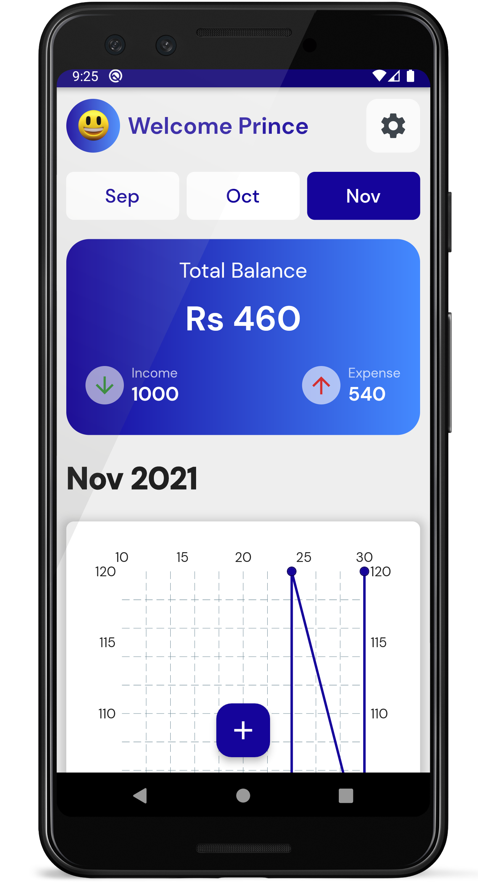
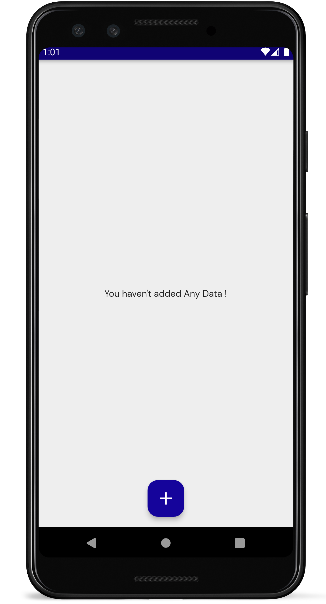
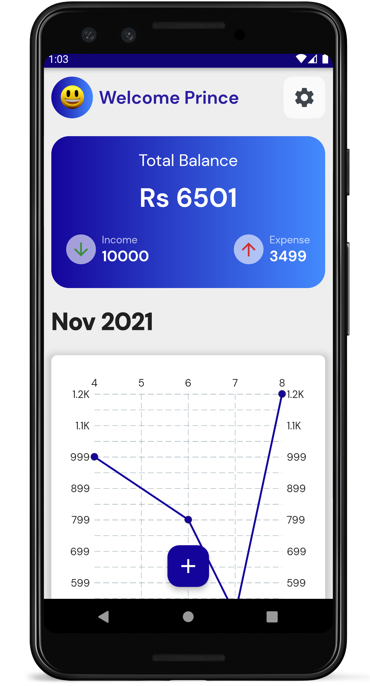
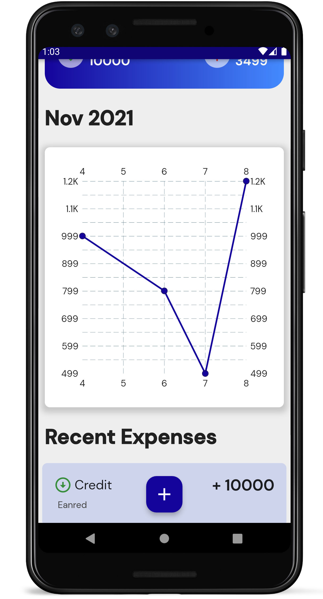
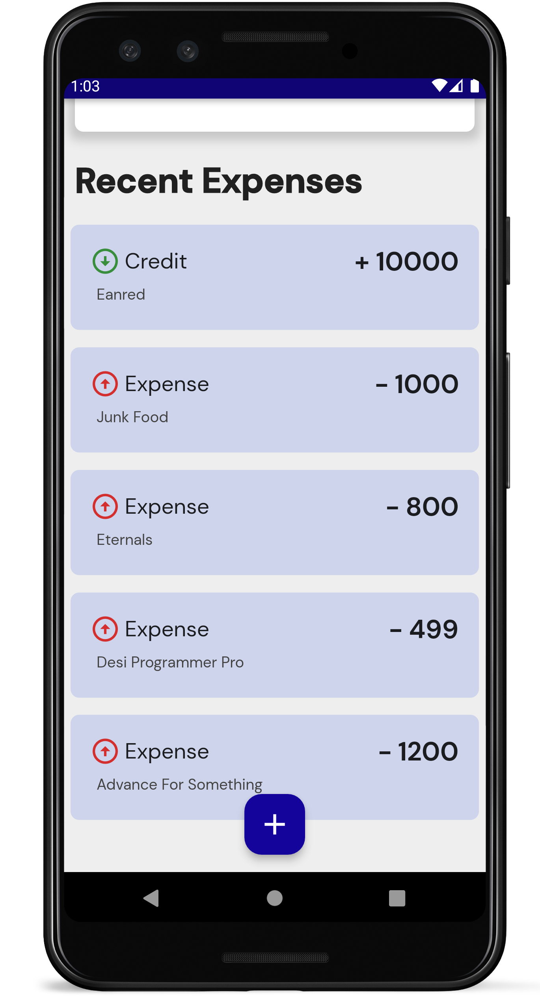

# `Expense App`

This app helps you with managing Income and Expense. It is coded in flutter, dart hive. 

```


# `Screenshots`













# `Credits`

```
## Face Emoji : http://clipart-library.com/images_k/transparent-happy-emoji/transparent-happy-emoji-15.png

## Icon : <div>Icons made by <a href="https://www.flaticon.com/authors/gowi" title="GOWI">GOWI</a> from <a href="https://www.flaticon.com/" title="Flaticon">www.flaticon.com</a></div>

## App Icon : <a target="_blank" href="https://icons8.com/icon/pBgBsoOMl5LD/money">Money</a> icon by <a target="_blank" href="https://icons8.com">Icons8</a>
```


